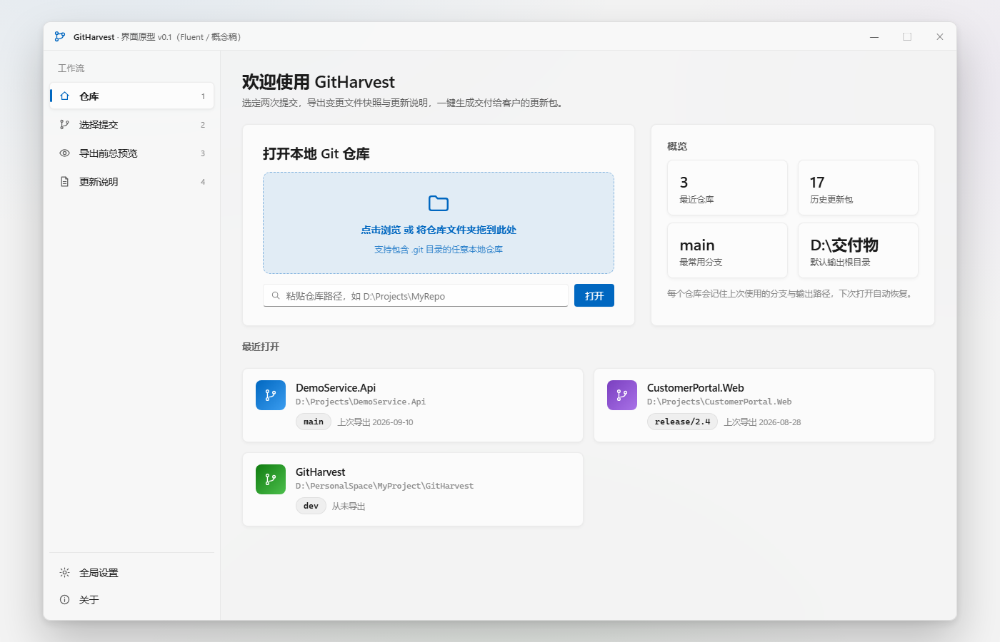
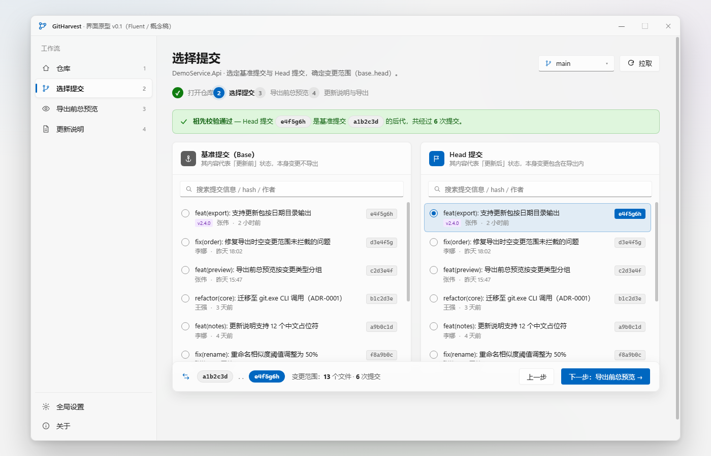
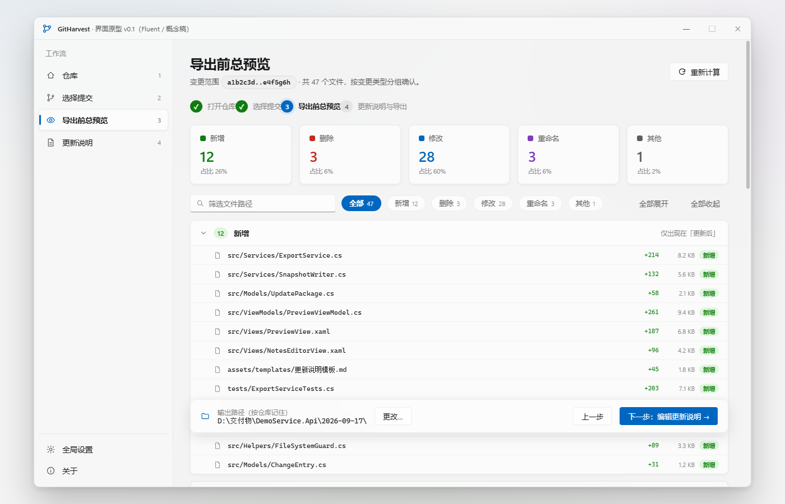
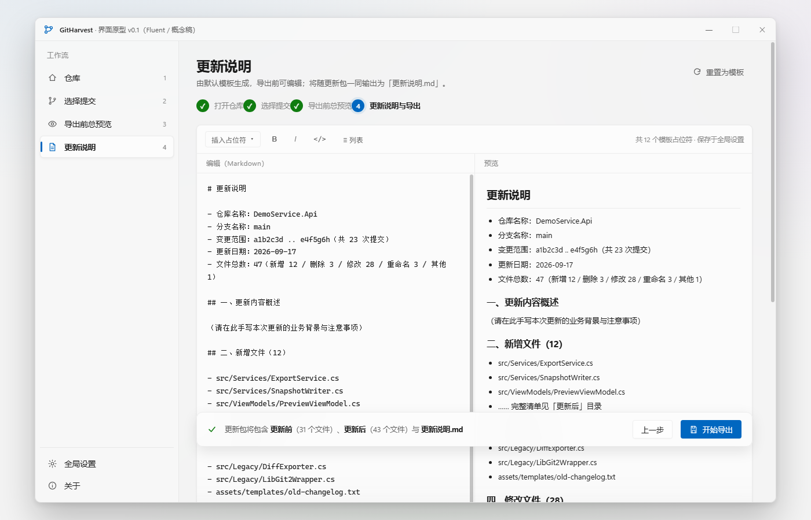

<div align="center">

# GitHarvest 🌾

**本地 Git 仓库变更导出工具 —— 选定两次提交，一键导出交付级的更新包**


*面向交付场景：把「这两次提交之间改了什么」变成客户拿到就能用的更新交付物。*

</div>

---

## 📖 这是什么

给客户/现场交付软件更新时，你通常需要回答：**改了哪些文件？旧版什么样、新版什么样？这次更新要注意什么？**

GitHarvest 把这件事流程化：选定 Git 仓库里的**基准提交**与 **Head 提交**，自动导出两者的变更文件快照（「更新前」「更新后」两个文件夹，保留目录结构）与一份由模板生成的「更新说明.md」，打包成可直接发给客户的**更新包**。

## 🖼️ 界面预览

<div align="center">

| 首页 · 仓库 | 选择提交 |
| --- | --- |
|  |  |
| **导出前总预览** | **更新说明编辑器** |
|  |  |

</div>

## ✨ 功能特性

- **五步式工作流**：打开仓库 → 选择提交 → 导出前总预览 → 编辑更新说明 → 一键导出
- **强约束防呆**：Head 必须是基准的后代（`merge-base` 强制祖先校验）；空变更范围禁止导出；导出前再次校验，不信任页面缓存
- **完整变更分类**：新增 / 删除 / 修改 / 重命名（含相似度）/ 其他（类型变更、子模块指针、二进制文件均如实标注）
- **导出前冲突预检**：非法字符、Windows 保留名、超长路径（260 字符上限预检）、仅大小写不同的同名文件——发现问题即中止并列出完整清单
- **更新说明模板**：12 个中文占位符自动填充（变更清单、统计、提交信息…），支持自定义模板，双栏实时预览
- **每仓库记忆**：记住每个仓库上次用的分支与输出路径；最近仓库列表
- **导出历史**：每次成功导出留档，首页统计「历史更新包数」
- **深浅主题**：Fluent Design，浅色 / 深色 / 跟随系统，即时切换
- **免安装**：单个 exe，self-contained 发布，目标机器**无需安装 .NET**
- **托盘常驻 + 单实例**：关闭窗口最小化到系统托盘；重复启动自动唤起已有窗口

## 📦 下载与运行

1. 到 [**Releases**](https://github.com/mysteryzyw/GitHarvest/releases) 下载最新的 `GitHarvest.exe`（约 64 MB，单文件）。
2. 放到任意目录，双击运行。**无需安装 .NET**，仅要求：
   - Windows 10 1809+（64 位）
   - 本机已安装 [Git](https://git-scm.com/)（分支读取、差异计算、快照导出都通过本机 `git.exe` 完成，启动时自动探测，也可在全局设置里手动指定路径）

> ⚠️ exe 未做代码签名，首次运行可能出现 SmartScreen「已保护你的电脑」提示——点「更多信息 → 仍要运行」即可。

数据（设置、导出历史、日志）默认存在 `%APPDATA%\GitHarvest`，卸载时删掉 exe 与该目录即可，无注册表残留。完整使用说明随 Release 一并提供。

## 🚀 基本流程

1. **仓库** —— 选择本地 Git 仓库（在子目录会自动上溯到仓库根，支持 bare 仓库）
2. **选择提交** —— 选分支，再选基准提交（不含）与 Head 提交（含）
3. **导出前总预览** —— 按变更类型分组核对文件清单与统计，确认后才动手
4. **更新说明** —— 模板自动生成草稿，12 个占位符 + 手写栏目（更新内容 / 操作步骤 / 注意事项）
5. **导出** —— 生成 `<输出路径>/<更新日期>/`：**更新前** + **更新后** + **更新说明.md**

## 🛠️ 从源码构建

```bash
git clone https://github.com/mysteryzyw/GitHarvest.git
cd GitHarvest

# 还原 & 构建（需要 .NET 9 SDK，Windows）
dotnet build GitHarvest.sln

# 运行单元测试（413 个）
dotnet test GitHarvest.sln

# 发布单文件 exe（产物在 src/GitHarvest/bin/Release/net9.0-windows/win-x64/publish/）
dotnet publish src/GitHarvest/GitHarvest.csproj -c Release -p:PublishProfile=single-file
```

> 注意：要发布的是 `publish` 目录下的 exe（约 64 MB）。构建输出目录里同名的 `GitHarvest.exe` 只有 184 KB，那只是启动器，单独拷走跑不起来。

### 技术栈

| 层      | 选型                                                                               |
| ------ | -------------------------------------------------------------------------------- |
| UI     | WPF + [WpfUI](https://wpfui.lepo.co/)（Fluent Design，Mica 背景）                     |
| 架构     | MVVM（CommunityToolkit.Mvvm）+ Microsoft.Extensions.DependencyInjection            |
| Git 访问 | 本机 git.exe CLI（`LC_ALL=C` + `-z` 分隔 + UTF-8，架构决策：不引 LibGit2Sharp，换来 LFS 与长期维护支持） |
| 数据     | JSON 持久化（settings / 每仓库状态 / 导出历史），Serilog 按天滚动日志                                 |
| 测试     | xUnit，413 个用例；测试接缝 = `IGitService`，集成测试用真实 git 仓库 fixture                        |

### 目录结构

```
src/
  GitHarvest.Core/     # 领域层（零 WPF 依赖）：git 访问、导出编排、模板、设置、历史
  GitHarvest/          # WPF 壳：Views / ViewModels / 主题 / 托盘
tests/
  GitHarvest.Tests/    # 单元 + 集成测试
assets/                # README 截图
```

## 📄 License

[MIT](LICENSE) © 2026 mysteryzyw (Kenji Muse)
